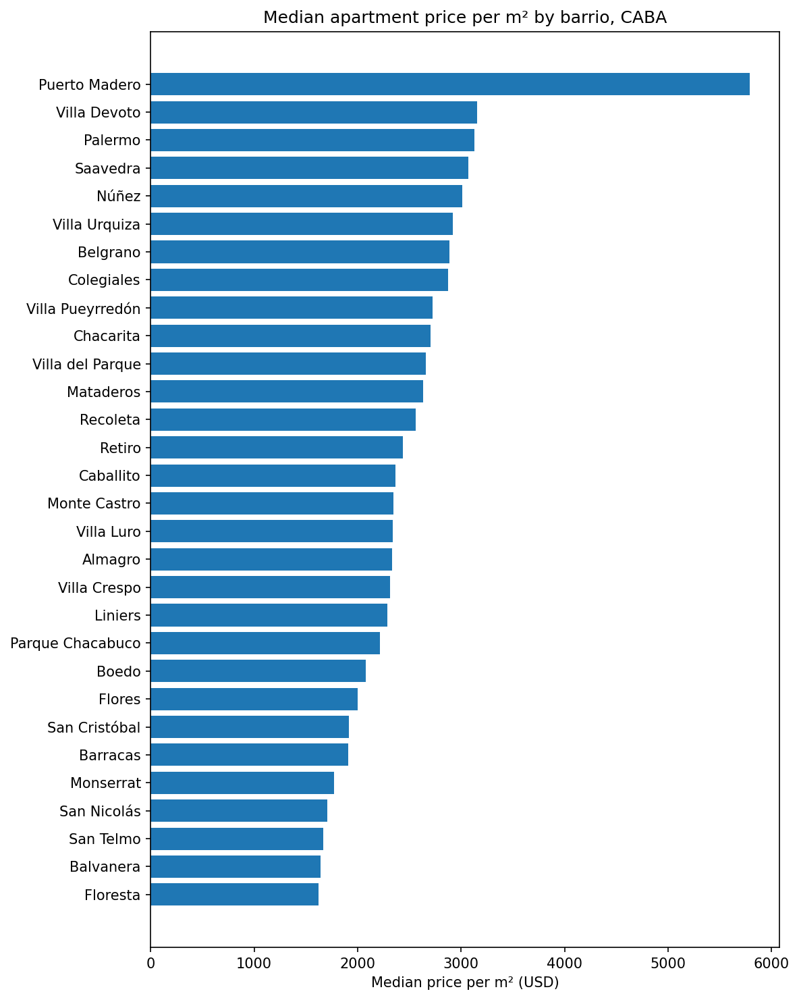
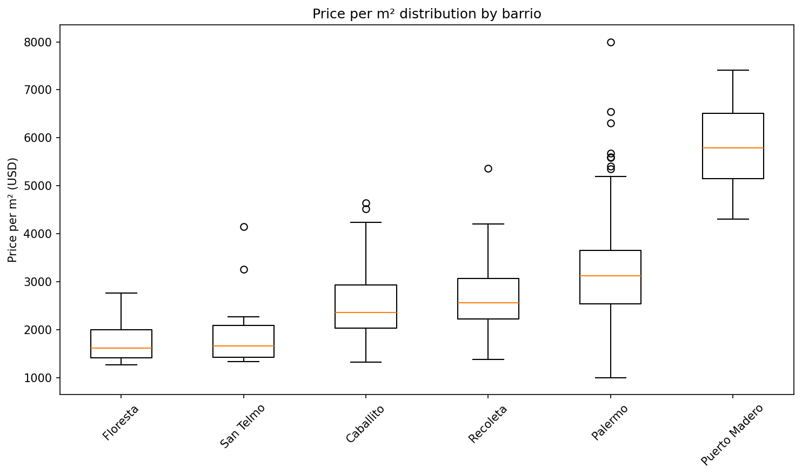
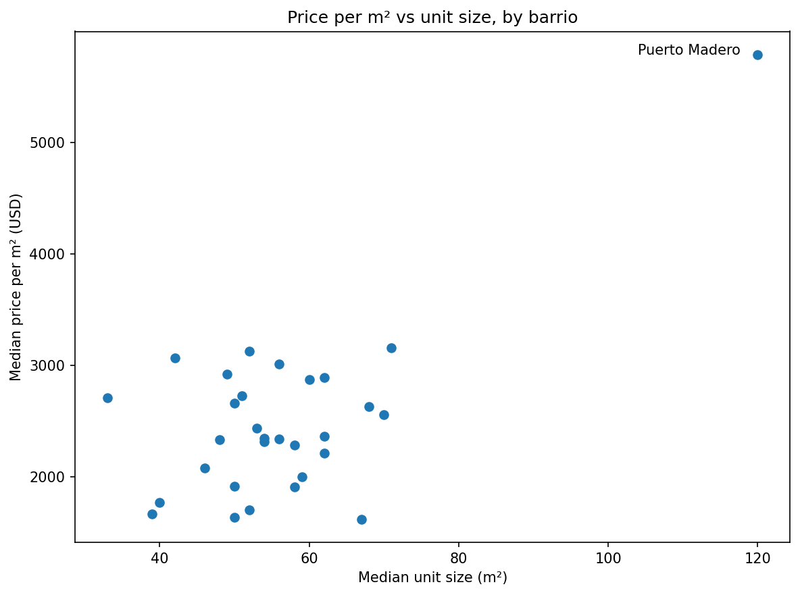
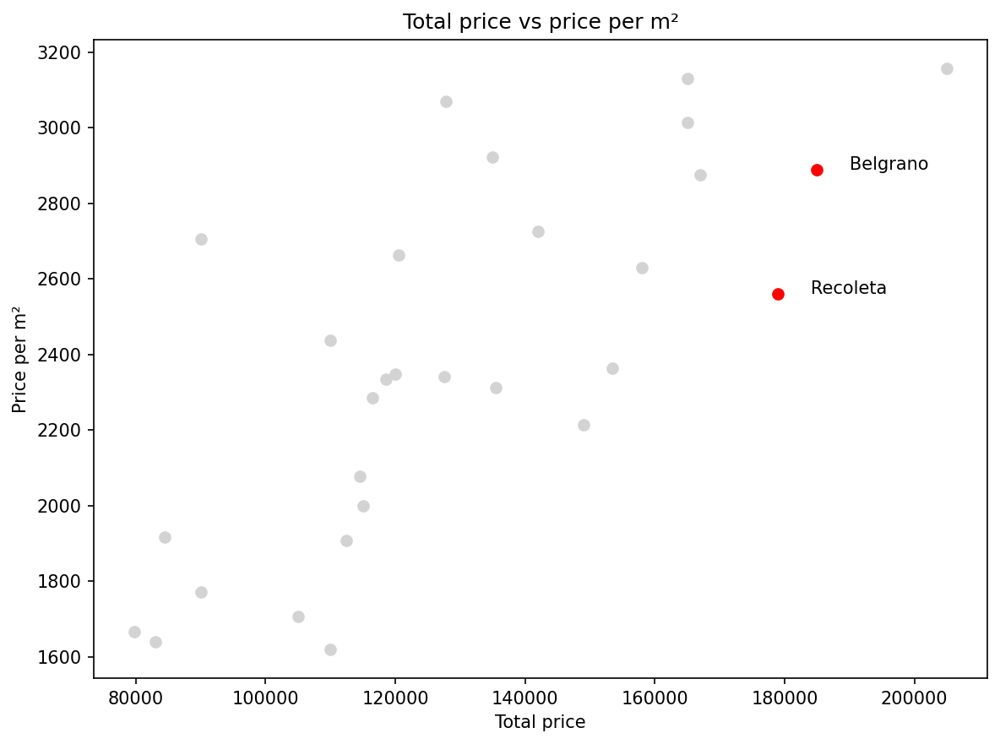

# Buenos Aires Real Estate: Apartment Prices Across CABA

A snapshot analysis of apartment sale listings in the City of Buenos Aires (CABA),
scraped from Argenprop. The dataset is a single snapshot of listings, with price
(in USD), neighborhood, surface area in m², and ambientes (a local count of living spaces,
where a studio is 1, a one-bedroom is 2, and so on). After cleaning and analyzing the data,
three findings stood out.

## Finding 1: CABA has a clear price-per-m² map, and Puerto Madero is in its own tier

Median price per m² runs from about 1,600 USD in barrios like Floresta and Balvanera
up to around 3,150 in Villa Devoto and Palermo. Puerto Madero sits alone at about
5,800, nearly double the next barrio. The ranking matches how the city actually
prices itself: the established residential barrios, especially toward the north, sit
at the top.

There is an important nuance, though. The ranking holds at the median, but it does not
mean the barrios sit in clean, separate price bands. Looking at the full distribution
within each barrio shows heavy overlap:

A typical Palermo apartment costs more per m² than a typical Recoleta one, but
Palermo's cheaper units sell for less per m² than Recoleta's pricier ones, so the
ranges cross. The barrio shifts where prices center; it does not pin them down.
Knowing the barrio narrows the price, it does not determine it. The one exception is
Puerto Madero, whose distribution sits entirely above every other barrio, with no
overlap at all. That is what "its own tier" really means.

## Finding 2: Location drives price per m², not unit size

You might expect smaller units to cost more per m². The data shows no such pattern.
Across barrios, the typical unit size tells you almost nothing about price per m²:
at any given size, price per m² is spread all over the map. And the single most
expensive barrio per m², Puerto Madero, also has the largest units, the exact
opposite of the hypothesis. Where the apartment is matters far more than how big it is.

## Finding 3: Expensive overall and expensive per m² are not the same ranking

A barrio can rank high on total price and only mid-pack on price per m². Recoleta is
the clearest case: it ranks 3rd by median total price but only 13th by price per m².
The reason is that you are paying for large, older apartments, not a per-m² premium.
Belgrano is a gentler version of the same pattern. (Puerto Madero is left out of this
chart because it tops both measures, and its scale would flatten everything else.)

## Data and method

The data was scraped from Argenprop with a custom pipeline built on httpx and
BeautifulSoup, which collected the listings and stored them in a Postgres database.
The neighborhood names arrived inconsistent and sometimes plain wrong, so the first
real step was normalizing them, collapsing 76 raw values into 41 clean barrios. From
there the analysis ran in SQL. Almost every listing was priced in USD, so I filtered
to USD and worked in a single currency. Of the two surface-area columns, total_m2
turned out to be empty, so I used covered_m2 as the denominator for price per m². I
had also wanted to compare pre-construction (pozo) apartments against finished ones,
but the pozo flag and the description field were both empty, so that comparison was
not possible. With the data cleaned and filtered, I computed per-barrio medians for
price per m², total price, and unit size, along with the most common room count, and
required at least 10 listings in a barrio before including it in the ranking.

## Limitations

The biggest limitation is that this is a single snapshot rather than a series over
time. Argenprop's anti-bot protection blocked running the scraper on a schedule, so
collection was manual and one-time, which rules out anything about how prices move or
how long listings stay on the market. This was a deliberate decision to scope the
project around what the data could actually support, not an oversight. Within that
snapshot, a few barrios rest on thin samples: the ranking requires at least 10
listings, but some sit close to that floor, and Puerto Madero in particular is based
on only 12, so its figures are indicative rather than precise. A couple of comparisons
I had hoped to make also fell away once I saw the data. USD versus peso pricing was a
non-question, since CABA apartments are listed almost entirely in dollars, and the
pozo-versus-finished split was impossible because the fields that would have flagged
it were empty.