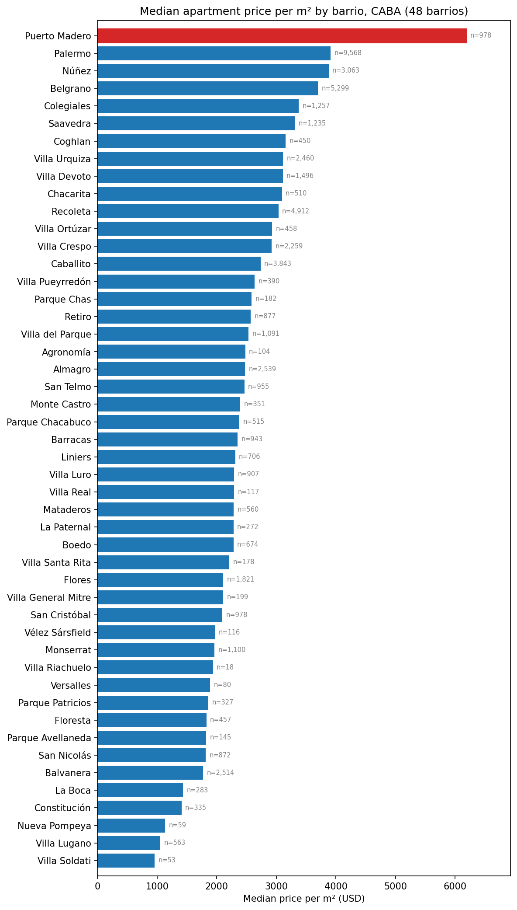
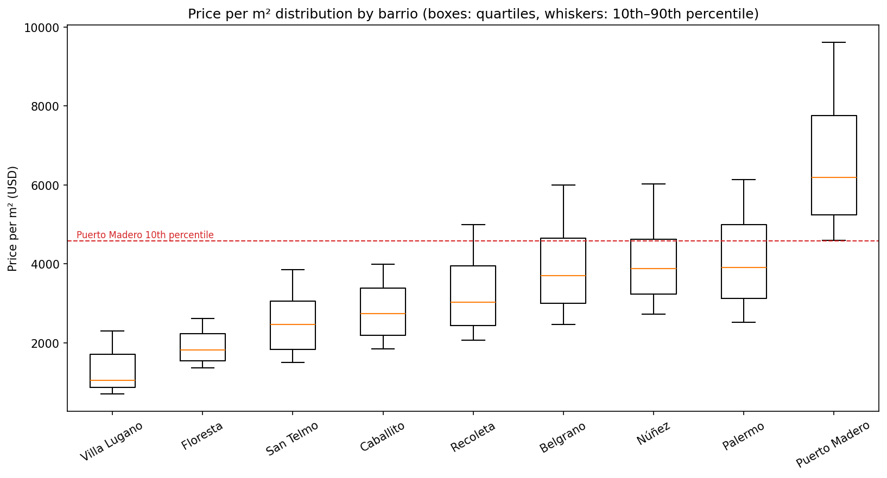
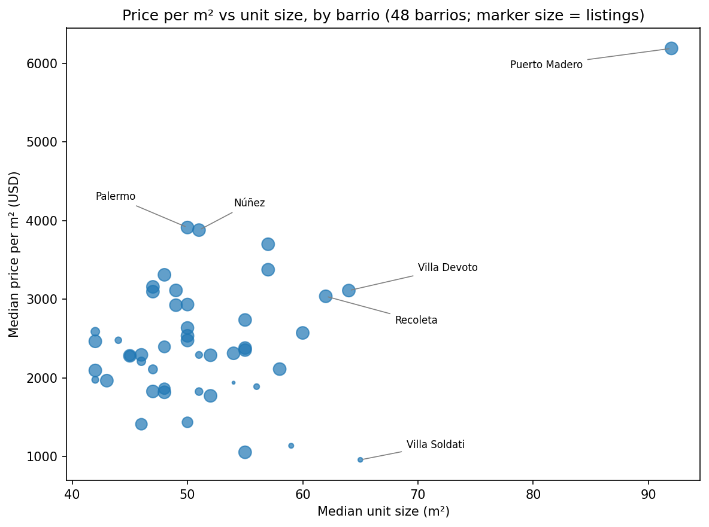
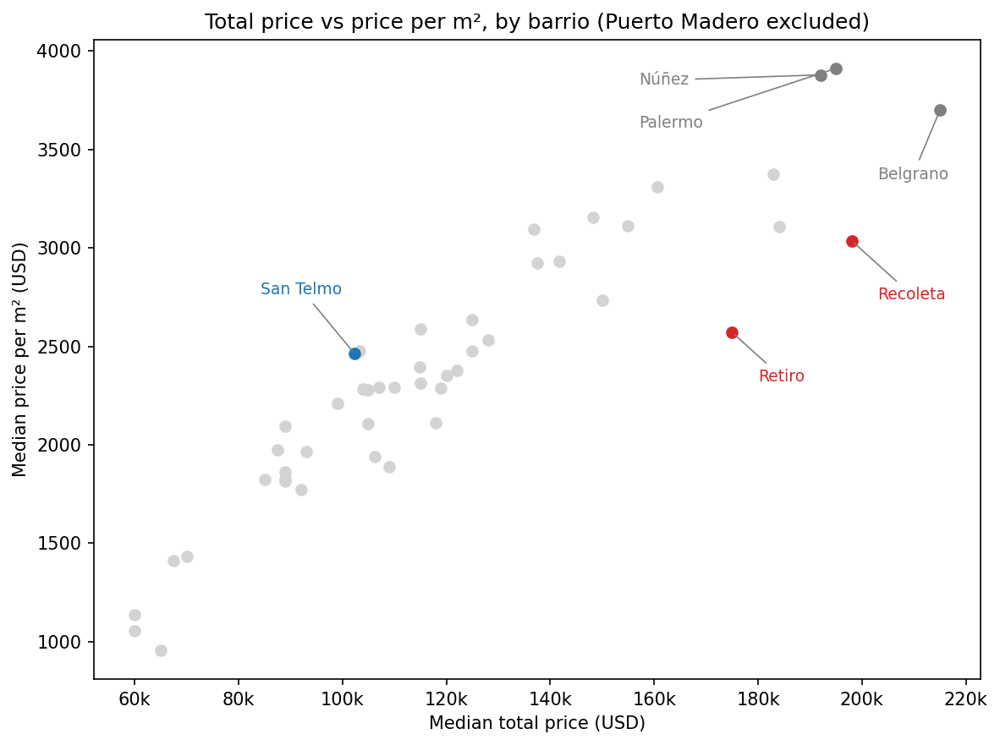

# Buenos Aires Real Estate: Apartment Prices Across CABA

A snapshot analysis of apartment sale listings in the City of Buenos Aires (CABA).
The dataset is a single snapshot of 59,069 listings covering all 48 barrios, scraped
from Mercado Libre Inmuebles and Argenprop in September 2026, with price (in USD),
neighborhood, covered surface in m², and ambientes (a local count of living spaces,
where a studio is 1, a one-bedroom is 2, and so on). It expands a first version of this
analysis, done in June 2026 on 1,901 Argenprop listings across 30 barrios; the three
findings from that version were re-tested on the full city, and this report states what
held, what needed correcting, and what the larger sample added.

## Finding 1: CABA has a clear price-per-m² map, and Puerto Madero is in its own tier at the median

Median price per m² runs from about 1,000 USD in Villa Soldati and Villa Lugano up to
about 3,900 in Palermo and Núñez. Puerto Madero sits on top at about 6,200, 1.58 times
the next barrio. The map matches how the city prices itself: the established residential
barrios toward the north and the river sit at the top (Palermo, Núñez, Belgrano,
Colegiales, Saavedra), the south at the bottom. The 18 barrios that the first version
could not rank for lack of listings fall exactly where the geography predicts: Coghlan
and Villa Ortúzar join the northern block, and the southern barrios that were missing
(La Boca, Constitución, Nueva Pompeya, Villa Lugano, Villa Soldati) form a new bottom
tier at 950–1,450 USD/m², well below the old floor of about 1,600.

The ranking holds at the median, but it does not mean the barrios sit in clean, separate
price bands. Looking at the full distribution within each barrio shows heavy overlap:

A typical Palermo apartment costs more per m² than a typical Recoleta one, but Palermo's
cheaper units sell for less per m² than Recoleta's pricier ones, so the ranges cross. The
barrio shifts where prices center; it does not pin them down.

This is where the first version overstated its case. With only 12 Puerto Madero listings,
its distribution appeared to sit entirely above every other barrio, and the report said
"no overlap at all". With 978 listings that is no longer true: Puerto Madero's 10th
percentile (about 4,600 USD/m²) sits below the 90th percentile of six barrios, among them
Palermo (6,140), Núñez and Belgrano (about 6,000). The premium segment of the northern
barrios reaches Puerto Madero's floor. Only 3% of Puerto Madero listings price below
Palermo's median, so "its own tier" survives as a statement about typical prices, not as
a wall. The zero-overlap claim was an artifact of a thin sample.

## Finding 2: Location drives price per m², not unit size

You might expect smaller units to cost more per m². The first version found no such
pattern by eye, across 30 barrio medians. The full sample lets this be measured, and the
result is stronger than the original claim: across the 48 barrios, the typical unit size
has no relationship to price per m² (rank correlation +0.06 once Puerto Madero is set
aside), and at the level of individual listings the barrio alone explains 46% of the
variation in price per m² while unit size explains 0.7%, and adds nothing on top of the
barrio. Within a barrio, doubling the covered area changes the price per m² by 0%. Where
the apartment is matters; how big it is, on average, does not.

The large sample also shows what that average hides. First, the size curve is not flat
everywhere: from 15 to 100 m² price per m² is level, at roughly 2,750–2,900 USD, but above
100 m² it rises to 3,200–3,600, and in Palermo units over 150 m² reach a median of about
5,100 USD/m², against 3,750–3,900 for the rest. Big apartments do carry a per-m² premium;
small ones do not. Second, the city holds two opposite local patterns that cancel out in
the aggregate. In central and southern barrios smaller units are pricier per m² (the
within-barrio correlation between size and price per m² is −0.5 to −0.6 in Nueva Pompeya,
San Nicolás, Constitución and San Telmo), while in the north larger units are (+0.3 in
Villa Devoto, Puerto Madero and Núñez). "Size does not matter" is true on average; "a
bigger unit never pays more per m²" is not.

## Finding 3: Expensive overall and expensive per m² are not the same ranking

A barrio can rank high on total price and only mid-pack on price per m². Recoleta remains
the clearest case: it ranks 3rd by median total price (198,000 USD) but 11th by price per
m² (about 3,040), because its typical unit is 62 m² against Palermo's 50. You are paying for
large, older apartments, not a per-m² premium. Retiro (8th by total price, 17th per m²),
Flores (22nd vs 32nd) and Versalles (27th vs 38th) show the same pattern, and the mirror
image exists too: San Telmo, Agronomía and Parque Chas are cheap in total but sit 7 to 14
places higher by price per m², because their units are small (42–44 m²).

The finding needs two corrections. The divergence between the two rankings is smaller
than it looked in June: the rank correlation between them is 0.93 now, against 0.78 in the
first version. With 10 to 20 listings per barrio, part of what looked like divergence was
sampling noise, and with the whole city the two orderings mostly agree. Belgrano, described
before as "a gentler version of the same pattern", no longer shows it (2nd by total price,
4th per m²). And the first version reported Recoleta as 3rd by total price because Puerto
Madero was left out of the chart; with every barrio included it was 4th then and is 3rd
now. (Puerto Madero is still left out of the chart: it tops both measures, and its scale
would flatten everything else.)

## Data and method

The first version scraped Argenprop with a custom pipeline built on httpx and
BeautifulSoup, storing listings in a Postgres database, and got 1,901 listings before the
portal's anti-bot protection cut the crawl. This version adds Mercado Libre Inmuebles as a
second source and crawls it one barrio at a time, reading the listing data that the portal
embeds as JSON in each search page; that yielded 62,318 listings across all 48 barrios,
including the 18 the first version could not rank. Both sources land in the same tables,
so the analysis code is unchanged: a listing is identified by source and source ID, and
barrio names are normalized from the sources' raw labels (64 raw values, including
sub-zones such as Palermo Soho or Belgrano R and informal names such as Barrio Norte or
Once, mapped onto the 48 official barrios).

The analysis dataset keeps apartments for sale priced in USD, within plausibility bounds
(20,000–5,000,000 USD, 15–500 m² covered, 1–8 ambientes), which removes 5.2% of the raw
listings: rentals, offices and PHs that the sources mixed into apartment searches, and
data-entry errors such as 111 USD asking prices or "1 m²" placeholders. Almost every
listing is priced in USD, so the analysis works in a single currency, and covered_m2 is
the denominator for price per m². Per-barrio medians of price per m², total price and unit
size follow the same method as the first version, with the same floor of at least 10
listings per barrio; the listing-level results in Finding 2 are new, and were computed as
the share of variance in log price per m² explained by the barrio, by log unit size, and
by both.

One rule governed the comparison with the first version. Comparing the order of barrios
between the two versions is sound: the same method on a larger sample. Comparing absolute
levels is not. Medians are 5–30% higher than in June in most barrios, and that mixes two
things this data cannot separate: a different source (Mercado Libre instead of Argenprop)
and three months of time. Every claim in this report about what changed is a claim about
ranks and about structure within the new dataset, not about price movements.

## Limitations

This is still a single snapshot rather than a series over time, so it says nothing about
how prices move or how long listings stay on the market. Coverage is complete for Mercado
Libre except in the largest barrios: the portal caps every search at 2,000 results, so
searches were split by ambientes (1, 2, 3 or more), and the 3-or-more segment of Palermo,
Belgrano, Recoleta and Caballito still hit the cap. Those four barrios are therefore
slightly under-represented in large units, which if anything understates their price per
m² given Finding 2. Argenprop, the source of the first version, contributes only 70
listings, all in Villa Real: its anti-bot protection now challenges a crawler after a
handful of requests and blocks it for more than fifteen minutes at a time, which made a
per-barrio crawl impractical. The dataset is in effect a Mercado Libre snapshot; the 70
Argenprop listings are kept as a separate source, so a Villa Real unit published on both
portals can appear twice. Thin samples are no longer a general
concern (the smallest barrio, Villa Riachuelo, has 18 listings, and Puerto Madero has
978), but the smallest barrios' figures are still indicative rather than precise. A
pre-construction versus finished split remains impossible, as neither source exposes a
usable flag in search results, and bedroom counts are available only from Argenprop, so
ambientes is the room measure throughout.
